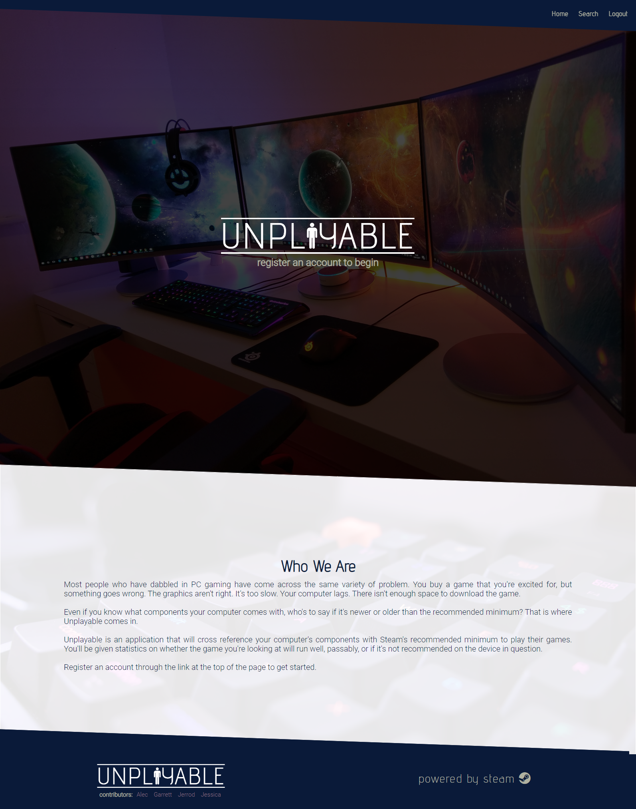
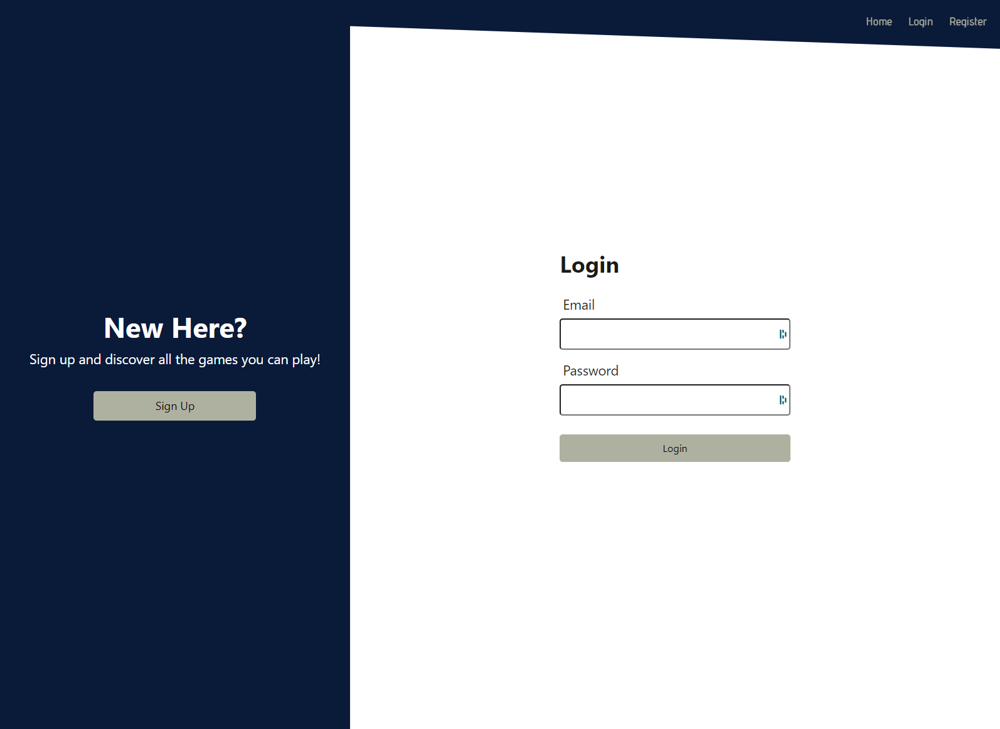
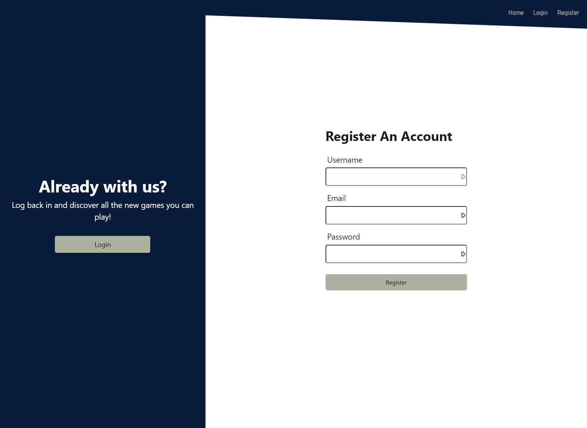
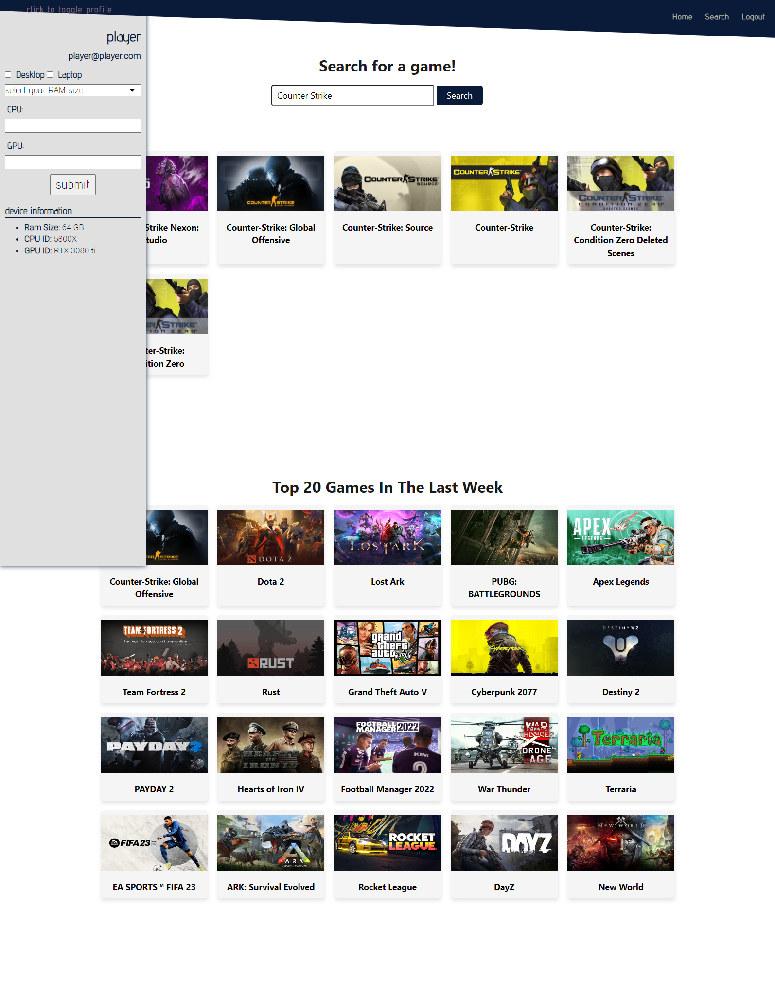
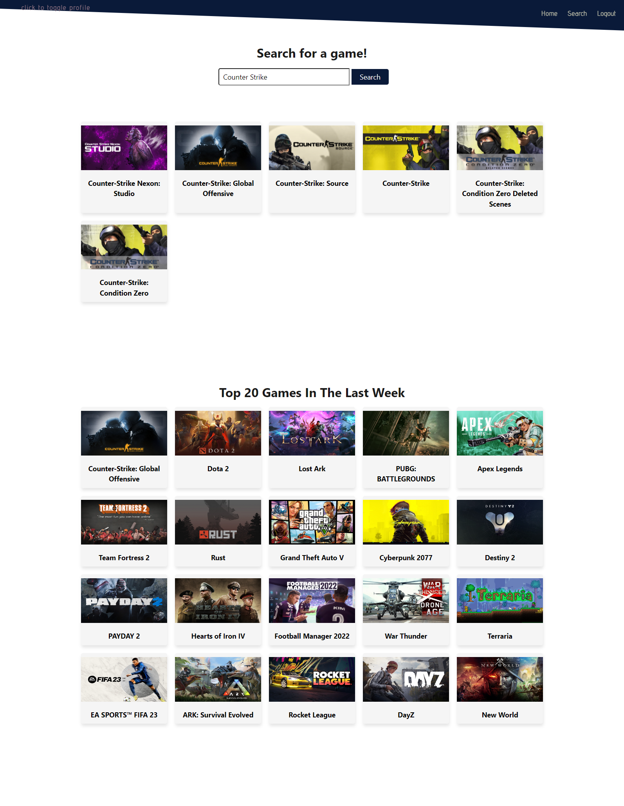

  

  
  

  

  
 ## Contributors to this project
 ### Jerrod Linderman, Jessica Lane, Garrett Lockhart, Alec Otterson

  

  

  
  

  
  
  <h1 align="center">Badges</h1>
  

  

  
  

  
  
  
  

  

  
  <h1 align="center" style="font-size:40px">
  
  UNPLAYABLE</h1>
  
  
  ## Table of Contents:
  1. [Description](#description)
  2. [Installation](#installation)
  3. [Usage](#usage)
  4. [How To Contribute](#contribute)
  5. [license](#license)
  6. [Tests](#tests)
  7. [Github](#github)
  8. [Email](#questions)

 

  ## Description
  Web application to see if your PC can play the games you want. Compares your current pc specs to game requirements and gives you a pass check if your system meets the requirements before you buy the game.

  ## Installation
  Clone repo, install node, run npm i, and then launch application using node server. Navigate to localhost:3001 and browse.  Aternatively, visit the live webpage at [unplayable.herokuapp.com](http://unplayable.herokuapp.com/).

  ## Usage
  Register an account and update your profile with your computer's specs, cpu, gpu and ram. These values will be taken into account and compared to game descriptions on Steam and let you know if your computer can run them. Search for a game and click the card of the game you wish to play and it will compare your computer's specs to the game's recommended and minimum specs. Currently popular games are shown by default.

 
  ## Contribute
  [Contributor Covenant](https://www.contributor-covenant.org/)

  ## License

  Published under the [MIT](license.txt) License.
  

  Read more about the license by clicking this link: [MIT](https://opensource.org/licenses/MIT).
 

  ## Tests
  no tests

  ## GitHub
  [nvmax](https://github.com/nvmax)

  [jessalane](https://github.com/jessalane)

  [garrettlockhart](https://github.com/GarrettLockhart)

  [alecotterson](https://github.com/acotterson)

  ## Questions
  If you have any questions, please contact us at our github pages.

  

 
